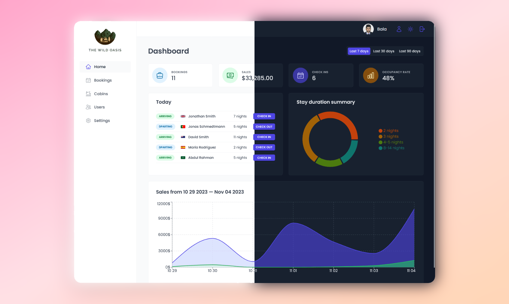

# The Wild Oasis Hotel Management App

The Wild Oasis is a comprehensive hotel management application designed for hotel employees to manage cabins, bookings, and guests. It utilizes advanced React techniques and integrates with Supabase for backend services to provide a streamlined and efficient tool for hotel operations.



## Table of Contents

- [Key Features](#key-features)
- [Built With](#built-with)
- [What I Learned](#what-i-learned)
- [Installation](#installation)
- [Author](#author)
- [Acknowledgments](#acknowledgments)

## Key Features

- **User Authentication**: Only hotel employees can sign up and log in. New users can only register within the app.
- **User Profiles**: Upload avatars, change names, and update passwords.
- **Cabin Management**:
  - View cabins with photos, names, capacity, prices, and discounts.
  - Update, delete, and create new cabins, including photo upload.
- **Booking Management**:
  - View bookings with arrival and departure dates, status, paid amount, cabin, and guest data.
  - Filter bookings by status: "unconfirmed," "checked in," or "checked out."
  - Manage bookings: delete, check in, check out, and handle payments.
- **Guest Information**: Track guest details such as full name, email, national ID, nationality, and country flag.
- **Dashboard**:
  - View guests checking in and out for the day with quick actions.
  - Access statistics on recent bookings, sales, check-ins, and occupancy rates.
  - Visualize daily sales (total and extras) and stay durations with charts.
- **Application-wide Settings**: Configure breakfast price, minimum and maximum nights per booking, and maximum guests per booking.
- **Dark Mode**: Personalized visual experience with dark mode.

## Built With

- **React**: For building dynamic user interfaces.
- **Supabase**: Backend services, including authentication and database management.
- **React Query**: Data fetching and caching.
- **React Router**: Navigation and routing.
- **React Hook Form**: Form handling and validation.
- **React Hot Toast**: Notifications for user feedback.
- **Recharts**: Data visualization with charts.
- **Styled Components**: Responsive UI design.
- **Vite**: Development and build tool.

## What I Learned

- **React Fundamentals**: Enhanced understanding of components, state management, and routing.
- **Authentication and User Management**: Implemented secure authentication and user profile management.
- **Form Handling**: Managed forms efficiently with React Hook Form.
- **Data Fetching and Caching**: Improved app performance with React Query.
- **Real-time Updates**: Enabled real-time updates with Supabase.
- **Responsive Design**: Created adaptable UIs using Styled Components.
- **Toast Notifications**: Added user-friendly feedback with React Hot Toast.
- **Data Visualization**: Used Recharts for insightful data representation.
- **Routing and Navigation**: Seamless navigation with React Router.
- **Settings Management**: Configured application-wide settings.
- **Advanced React Patterns**: Utilized Higher-Order Components and Compound Component Pattern for better code organization.
- **Dark Mode**: Implemented a personalized visual experience with dark mode.
- **Version Control**: Managed project changes with Git.
- **Project Management**: Planned and managed a large-scale project effectively.

## Installation

To run the Wild Oasis app locally:

1. Clone the repository:
   ```bash
   git clone https://github.com/Balmoorthy/the-wild-oasis.git
   ```
2. Install dependencies::
   ```bash
   npm install
   ```
3. Build command::
   ```bash
   npm install
   ```
4. Live server:
   ```bash
   npm install
   ```

## Author

Bal Moorthy:

- [**Github**] - (`https://github.com/Balmoorthy`)
- [**LinkedIn**] - (`https://www.linkedin.com/in/bal-moorthy/`)

Feel free to contact me with any questions or feedback!
